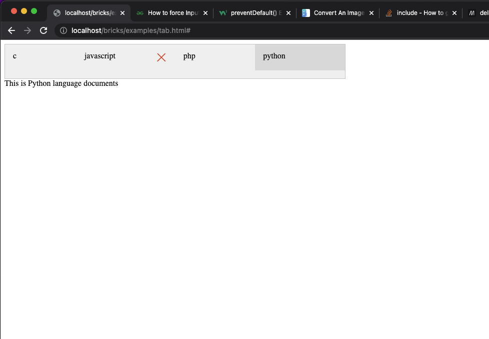

# Toolbar
The Toolbar widget provides a toolbar componets which provide a tool bar interface service, and you can add, delete tool at runtime dynamicly.
## use case
```
  <html>
  <head>
  <link rel="stylesheet" href="../css/bricks.css">
  </head>
  <body>
  <script src="../bricks.js"></script>

	<script>
		const opts = 
{
	"widget": {
		"widgettype":"Toolbar",
		"options":{
			"target":null,
			"orientation":"vertical",
			"tools":[
				{
					"name":"c",
					"Label":"C",
					"icon":null
				},
				{
					"name":"javascript",
					"Label":"JavaScript",
					"icon":null
				},
				{
					"name":"php",
					"Label":"PHP",
					"icon":null
				},
				{
					"name":"python",
					"Label":"Python",
					"icon":null
				},
			]
		}
	}
}

		;
		const app = new BricksApp(opts);
		app.run();
	</script>
</body>
</html>
```
and the result like this:<br>


## inheritance
Toolbar inherited from BoxLayout

## options
```
    {
        orientation:
        tools:
    }
```
### orientation
should be 'vertical' means tool widgets will arrange in vertical  or 'horizontal' means tool widgets will arrange in horizontal
### tools:
a array contains a list of tool objects

### tool object 
tool object has following properties:
```
    {
        icon:
        name:
        label:
		removable:
    }
```
#### icon is a image url, it is optional, if present, the tool will show a icon before the tool's text
#### name
name is a itendify field for the tools, it should be unique in this tools of this options scope.
#### label
label will translate by i18n for the language user used, and the result will be show. if label is miss, use the name of the tool object.
#### removable
if removable is true, the tool widget will append a delete image widget, and will remove the tool widget if user click the delete image widget.


## method
### createTool
createTool(toolOptions)

createTool create a tool widget and append the to end of the toolbar.

## event
toolbar has some events other widgets can bind to, they are:
### ready
after constructor call finished, and all the tools built, toolbar will fire this event

### command
after user click on one of the tool widgets, toolbar will fire this event with the tool's options used to construct it as the parameters, can get the parameters using "event.params"
.
### remove
after user click delete image widget, toolbar delete the tool widget from toolbar, and fire this event.
